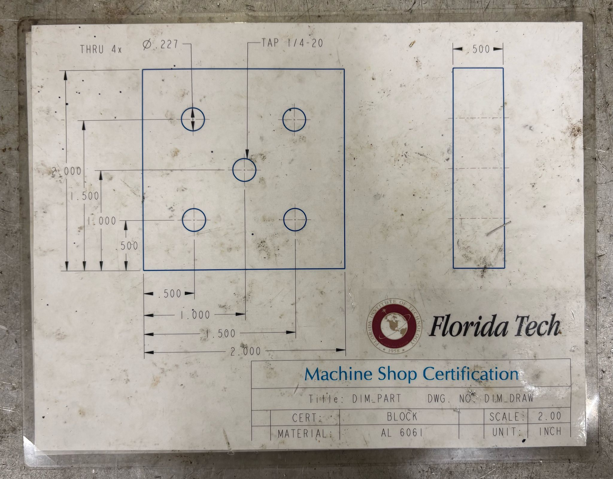
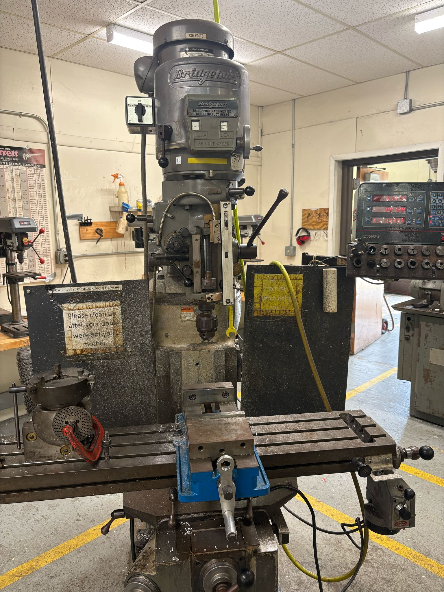
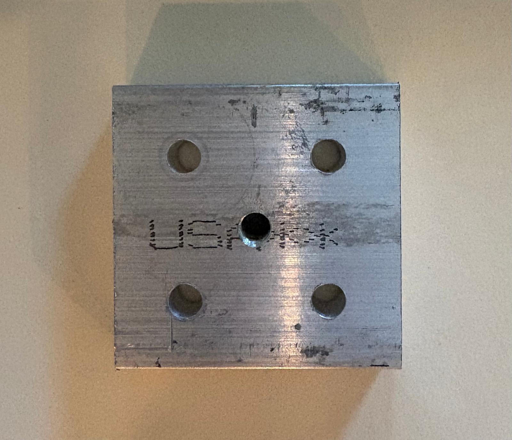
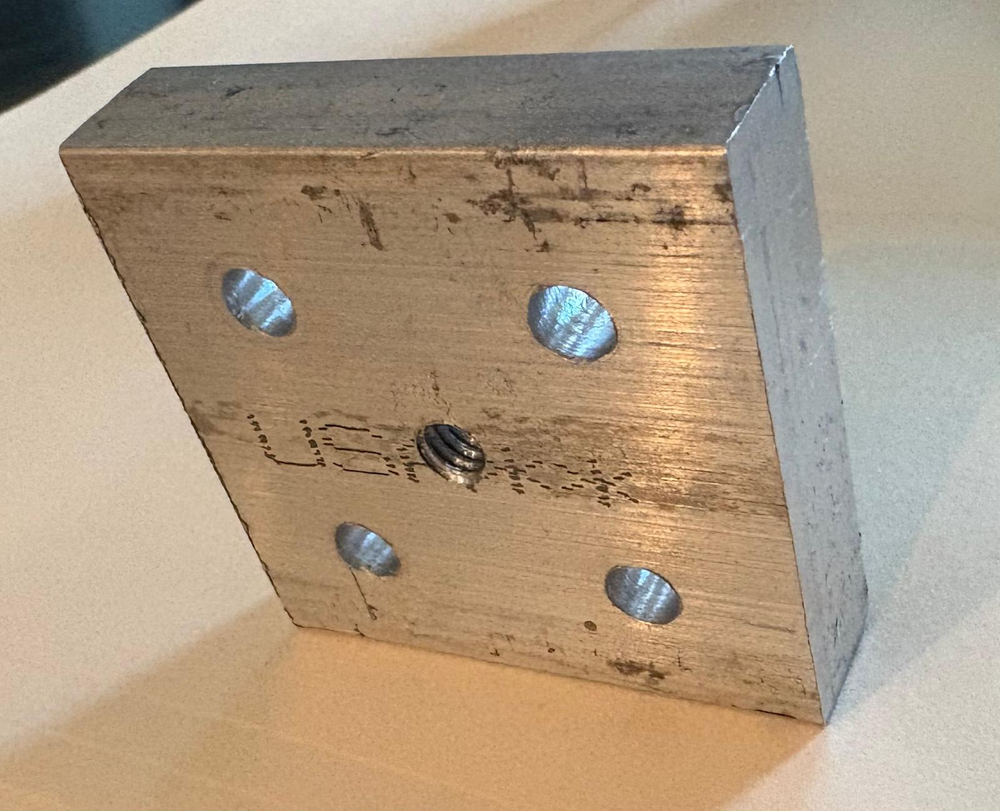

# 📐 GD&T Block Project

This project involved fabricating a precision-machined aluminum block using a Bridgeport mill and interpreting GD&T from a detailed technical drawing.

🛠️ I completed this for **Project Vulcan**, not only to help fabricate components, but to better understand machining limitations and **design with manufacturability in mind**.

---

## 🧠 Process Overview

### 1. Reviewing Technical Drawings

The GD&T drawing provided toleranced dimensions, thread callouts, and feature control frames for hole placement and block geometry.

---

### 2. Stock Preparation and Setup

The raw aluminum was squared and measured using calipers, then mounted securely in the vise of a Bridgeport mill.

- Material: AL 6061  
- All six sides were faced flat to prep for dimensioning and drilling

---

### 3. Machining and Hole Drilling

Used the DRO to locate hole positions based on the drawing’s datums. Four holes were drilled through, and one center hole was tapped.

  

- Center drilled for precision  
- Drilled using sharp bits and manual feeds  
- Center hole was tapped ¼-20 UNC

---

### 4. Finishing and Verification

After chamfering edges, all dimensions were checked with a caliper. The block was deburred, cleaned, and visually inspected.

- All hole locations were within ±0.005" tolerance  
- Chamfers added to all exposed edges

---

## 🛠️ Tools Used  
- **Bridgeport Manual Mill** – for facing and drilling  
- **Calipers + Steel Rule** – for in-process metrology  
- **¼-20 Tap** – for center-threading  
- **Deburring Tools** – for final finishing  

---

## ⏳ Time & Certification Context

This project took ~2 hours to complete. It was part of Florida Tech’s **machine shop certification**.

Critically, it supported my role on **Project Vulcan** by deepening my understanding of **tolerancing, feature accessibility, and real-world machining constraints** during the design phase.
