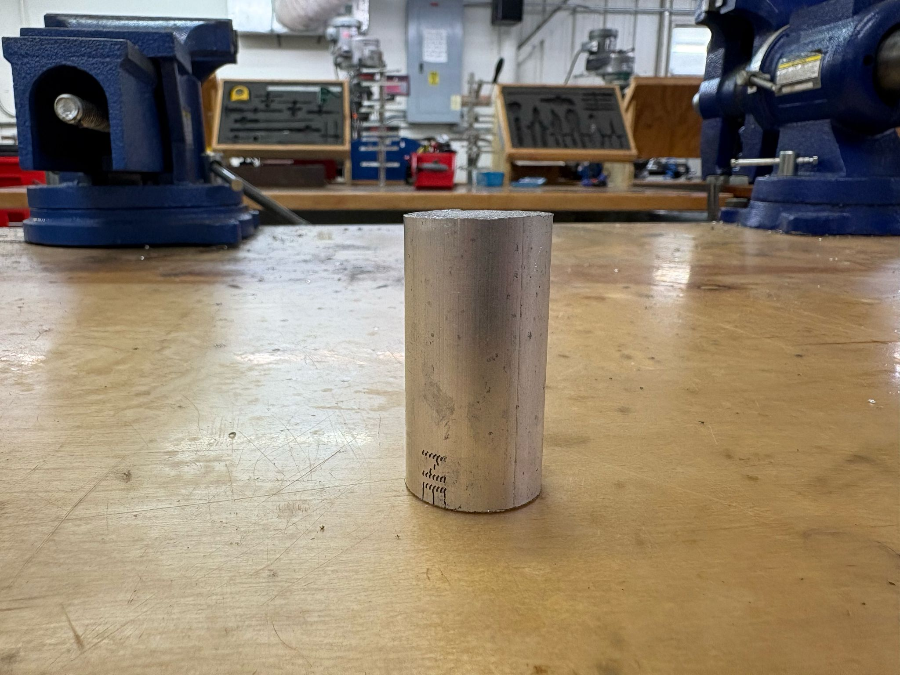
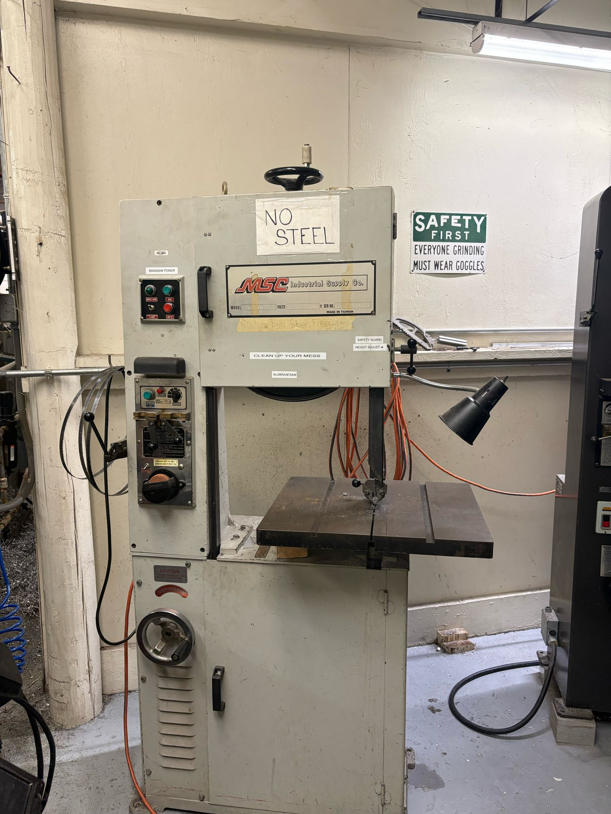
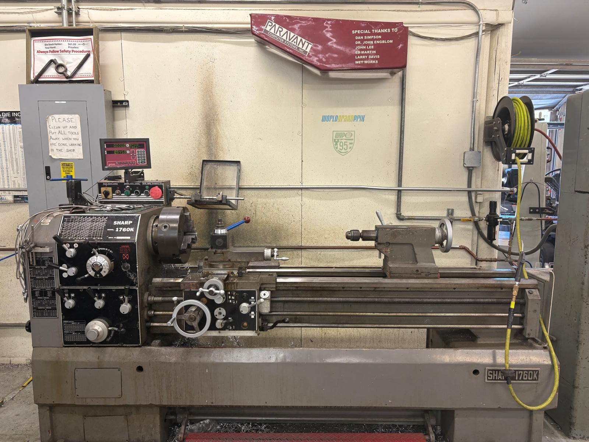
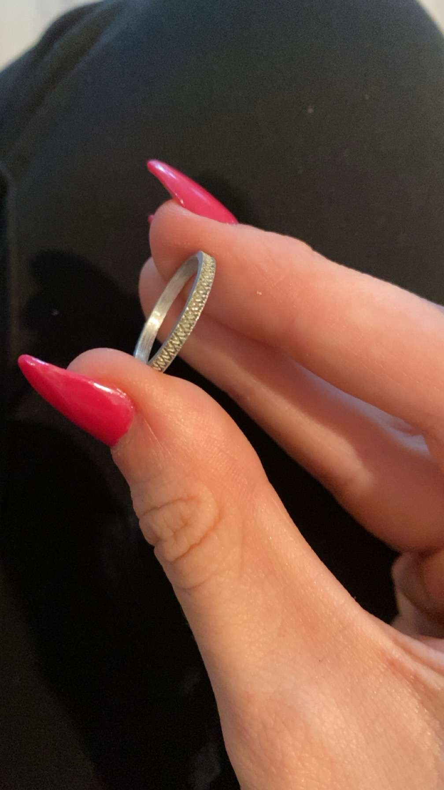
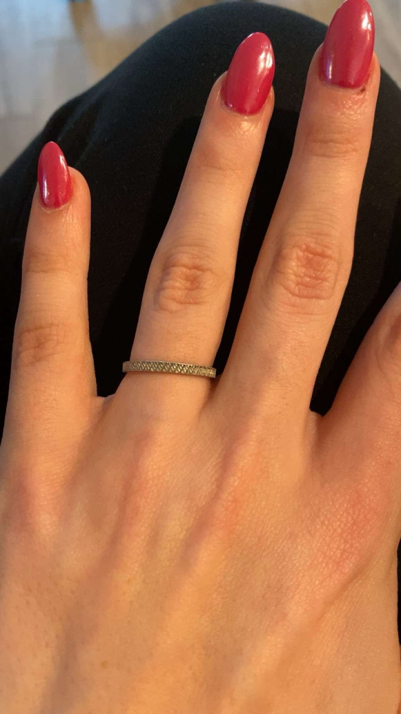

# 💍 Aluminum Ring Project

This project involved machining an aluminum ring from raw stock using a bandsaw and manual lathe. It was completed as part of Florida Tech’s machine shop certification and as a training initiative under the Florida Tech Rocketry Club.

*Made this one for my girlfriend — she's still wearing it!*

---

## 🛠️ Process Overview

### 1. Stock Selection and Prep  

- Chosen material: aluminum rod (AL 6061)  
- Cut to approximate length on the **Turn-Pro bandsaw**

### 2. Facing and Drilling  

- Faced both sides using the **Sharp 1760K manual lathe**  
- Center drilled and bored out to desired inner diameter

### 3. Turning the Outer Profile  

- Outer diameter carefully turned and chamfered for comfort  
- Target wall thickness: ~1.5 mm

### 4. Final Product  
  

---

## 🛠️ Tools Used  
- **Turn-Pro Bandsaw** – for cutting raw aluminum  
- **Sharp 1760K Manual Lathe** – for facing, boring, and profiling  
- **Calipers + Ring Gauge** – for accurate sizing  
- **Polishing compounds and hand tools** – for finishing

---

## ⏳ Time & Certification Context  
This project was completed in roughly 2 hours as part of Florida Tech’s **machine shop certification**.  
It also served as a foundational experience for **Project Vulcan**, reinforcing the importance of **designing for manufacturability** through direct interaction with machining limitations and tolerances.

